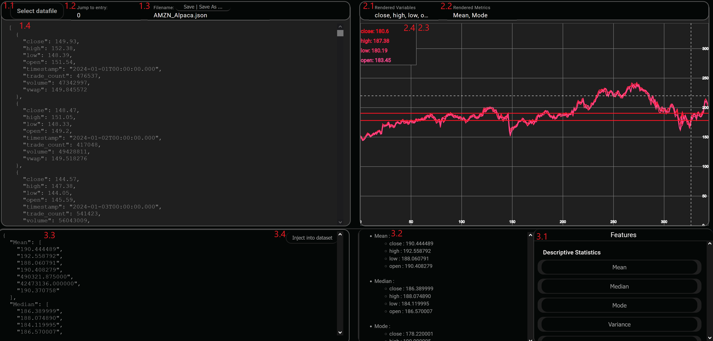

# DataBend
This application is designed to automate feature engineering for machine learning datasets, alongside visualizing the features with the dataset itself. By uploading a JSON file through the front-end UI, a few button clicks, and features like descriptive statistics are calculated and packaged into a dictionary. The dictionary's contents are completely user-defined and can even be edited directly for any custom needs. Once desired changes are made, you can inject the dictionary into the dataset and save the file or create a new data file by specifying a new file name. Now the data file contains pre-calculated metrics that can be extracted and used in machine learning applications like time series forecasting.


This application's backend consists of a C++-based Crow API server interfacing with a custom mathematics and data handler library. While the front-end utilises Angular CLI (version), Node (version), Vite (version), D3, and singleton services (for variable and function sharing).


Currently, there is only support for Windows and Linux-based operating systems.


## JSON limitations
Currently, due to a sparse C++ back-end, the only type of supported JSON structure is an array of objects with numeric field types only, since this tool was initially designed around 2D-based numeric datasets. The JSON format should be as follows;
```
{
    [
        {
            "Key":number_value,
            ...
        },
        ...
    ]
}
```


 Additionally, JSON files must be placed in the datafile subdirectory in order for the Crow API to access the files.


## Using the JSON component
1.1: To load a data file, you can click the "Select data file" button, and it will prompt you to navigate to the targeted file.


1.2: Once a dataset is loaded, you can jump to a specific entry in the JSON editor by typing the index and pressing Enter.


1.3: To save the current file, you can click the "Save | Save as" button, without changing the file name input field. If the file name input is the same as the loaded file name, then the original file will be overwritten. But if the file name input has been changed, then the file will be saved as a new file under the provided file name.


1.4: To make any changes to the core JSON file, you can directly edit the file contents from the JSON editor


## Using the D3 component


2.1: When a data file is loaded, a blank 2D scene is initialized. To load in variables extracted from your dataset, select the "rendered variables" dropdown menu, and select all the variables you want rendered.


2.2: If you have calculated any metrics using the features component, then they will be available to add to the graph under the "rendered metrics" dropdown menu, and then select the metrics you want to view.


2.3: All the visuals are contained here in the D3 SVG
- 2.4: When hovering over the graph, the current values being hovered over will be displayed in the top left legend. All variables chosen to be rendered will appear here and display the current values.


- 2.5: To zoom in on your rendered variables, you can use the middle mouse button, and to pan left and right, hold left click and drag your mouse.


## Using the Features component


3.1: To calculate any features, navigate through the dropdown menus, select a category, and select the feature to be calculated.


3.2: Any calculated metrics will appear here in a neat list displaying the feature and its calculated values for each variable.


3.3: Just like the JSON editor, you can also directly edit the dictionary being added to the dataset. 

3.4: Once desired changes have been made, if any, you can inject the dictionary into the loaded dataset. From here, you can either overwrite the current file or create a new file with the injected dictionary.




## Future features
- Inferential statistics and tests
- Correlation functions
- Regression analysis
- Econometrics for financial datasets
- Loading existing feature dictionaries from datasets